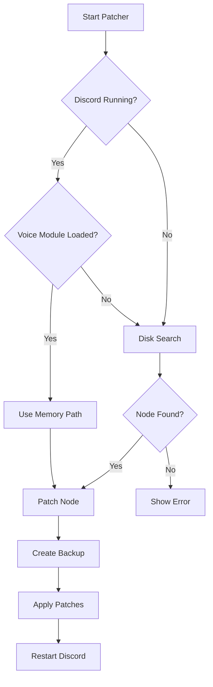

# 🎙️ Discord Voice Node Patcher For Stereo

**Studio-grade audio quality for Discord with configurable gain control.**


---

## 🆕 What's New in v2.5

> [!TIP]
> **No voice channel required!** Disk-based fallback automatically finds `discord_voice.node` even when Discord isn't in a voice channel. Plus all the features from v2.1: Modern GUI, 1x-10x gain control, 48kHz sampling, and 382kbps bitrate.

### v2.5 Improvements

✨ **Disk-Based Fallback** — Automatically finds `discord_voice.node` without joining voice channels  
✨ **Smart Detection** — Searches all Discord variants (Stable, PTB, Canary, Development)  
✨ **Auto-Elevation** — Automatically requests admin privileges when needed  
✨ **Enhanced Restore** — Improved backup management with interactive restore menu  
✨ **Better Logging** — More detailed operation logs for troubleshooting

| Feature | Before | After |
|---------|:------:|:-----:|
| **Sample Rate** | 24 kHz | **48 kHz** ✨ |
| **Bitrate** | ~64 kbps | **382 kbps** ✨ |
| **Channels** | Mono (downmixed) | **True Stereo** ✨ |
| **Gain Control** | Fixed | **1x-10x Adjustable** ✨ |
| **Detection** | Requires voice channel | **Disk-based fallback** 🆕 |

---

## 🚀 Quick Install

**Step 1: Install a C++ Compiler**

Choose one (Visual Studio recommended):
- [Visual Studio](https://visualstudio.microsoft.com/downloads/) — Install "Desktop development with C++"
- [MinGW-w64](https://www.mingw-w64.org/downloads/)
- [LLVM/Clang](https://releases.llvm.org/download.html)

**Step 2: Run the Patcher**

```powershell
# Right-click PowerShell → "Run as Administrator" (or just run it - auto-elevates!)
.\DiscordVoicePatcher_v2_5.ps1
```

<details>
<summary><strong>Command Line Options (Advanced)</strong></summary>

```powershell
# Patch with GUI (auto-elevates if needed)
.\DiscordVoicePatcher_v2_5.ps1

# Command line with 3x gain, no GUI
.\DiscordVoicePatcher_v2_5.ps1 -NoGUI -AudioGainMultiplier 3

# Unity gain (no amplification)
.\DiscordVoicePatcher_v2_5.ps1 -NoGUI -AudioGainMultiplier 1

# High gain, skip backup (not recommended)
.\DiscordVoicePatcher_v2_5.ps1 -NoGUI -AudioGainMultiplier 5 -SkipBackup

# Restore from most recent backup
.\DiscordVoicePatcher_v2_5.ps1 -Restore

# List all available backups
.\DiscordVoicePatcher_v2_5.ps1 -ListBackups
```
</details>

---

## 💬 Requirements

| Component | Requirement |
|-----------|-------------|
| **Operating System** | Windows 10/11 (64-bit) |
| **PowerShell** | 5.1 or higher |
| **Discord Version** | v9219 (Stable) |
| **Permissions** | Administrator (auto-requests if needed) |
| **Compiler** | MSVC / MinGW / Clang |

---

## ✨ Features

### Audio Quality
- 🎵 **48kHz Sample Rate** — Crystal clear high-frequency reproduction
- 🔊 **382kbps Opus Bitrate** — Studio-quality encoding
- 🎧 **True Stereo Output** — Full stereo separation, no downmixing
- 🎚️ **1x-10x Gain Control** — Adjustable amplification with GUI

### Smart Detection (NEW in v2.5)
- 🔍 **Disk-Based Fallback** — Finds `discord_voice.node` without voice channel
- 🔄 **Multi-Variant Support** — Detects Stable, PTB, Canary, and Development
- 📂 **Intelligent Search** — Automatically finds newest Discord version
- ⚡ **Auto-Elevation** — Requests admin privileges when needed

### Reliability
- 🛡️ **Automatic Backups** — Timestamped backups before patching
- 🔄 **Interactive Restore** — Easy backup restoration with menu
- 📝 **Comprehensive Logging** — Detailed operation logs
- ⚙️ **Config Persistence** — Remembers your last settings

### User Experience
- 🎨 **Modern GUI** — Discord-themed interface with safety warnings
- ⚡ **Command-Line Support** — Automation-friendly parameters
- 📊 **Real-Time Warnings** — Color-coded safety indicators
- 🎯 **Smart Defaults** — Safe settings out of the box

---

<details>
<summary><h2>🎛️ GUI Interface</h2></summary>

### Gain Multiplier Guide

| Multiplier | Use Case | Safety |
|------------|----------|:------:|
| **1x** | Unity gain (no amplification) |  |
| **2x** | Moderate boost for quiet mics |  |
| **3x** | Noticeable amplification |  |
| **5x** | High amplification |  |
| **10x** | Maximum amplification |  |

### GUI Elements

- **Slider Control** — Smooth 1x to 10x gain adjustment
- **Live Preview** — See current multiplier in real-time
- **Color Coding** — Green (safe), Yellow (moderate), Red (high risk)
- **Backup Option** — Toggle automatic backup creation
- **Patch Button** — Apply settings and patch Discord
- **Cancel Button** — Exit without changes

</details>

<details>
<summary><h2>⚙️ Command-Line Parameters</h2></summary>

| Parameter | Type | Default | Description |
|-----------|------|---------|-------------|
| `-AudioGainMultiplier` | Int (1-10) | 1 | Audio amplification factor |
| `-SkipBackup` | Switch | False | Skip backup creation |
| `-NoGUI` | Switch | False | Run without GUI |
| `-Restore` | Switch | False | Restore from most recent backup |
| `-ListBackups` | Switch | False | List all available backups |

### Examples

```powershell
# Safe default (2x gain with backup)
.\DiscordVoicePatcher_v2_5.ps1 -NoGUI -AudioGainMultiplier 2

# Maximum quality (unity gain, no amplification)
.\DiscordVoicePatcher_v2_5.ps1 -NoGUI -AudioGainMultiplier 1

# High gain for quiet sources
.\DiscordVoicePatcher_v2_5.ps1 -NoGUI -AudioGainMultiplier 5

# Quick patch (skip backup)
.\DiscordVoicePatcher_v2_5.ps1 -NoGUI -AudioGainMultiplier 3 -SkipBackup

# Restore from backup
.\DiscordVoicePatcher_v2_5.ps1 -Restore

# View all backups
.\DiscordVoicePatcher_v2_5.ps1 -ListBackups
```

</details>

<details>
<summary><h2>📂 File Locations</h2></summary>

| Path | Description |
|------|-------------|
| `%TEMP%\DiscordVoicePatcher\patcher.log` | Operation logs |
| `%TEMP%\DiscordVoicePatcher\config.json` | Saved configuration |
| `%TEMP%\DiscordVoicePatcher\Backups\` | Voice module backups (max 10) |
| `%TEMP%\DiscordVoicePatcher\*.cpp` | Generated C++ source files |
| `%TEMP%\DiscordVoicePatcher\*.exe` | Compiled patcher executable |

### Discord Installation Paths (Auto-Detected)

The patcher automatically searches these locations:
- `%LOCALAPPDATA%\Discord` — Discord Stable
- `%LOCALAPPDATA%\DiscordPTB` — Public Test Build
- `%LOCALAPPDATA%\DiscordCanary` — Canary Build
- `%LOCALAPPDATA%\DiscordDevelopment` — Development Build

### Backup Naming Format
```
discord_voice.node.YYYYMMDD_HHMMSS.backup
```

Example: `discord_voice.node.20250113_143022.backup`

</details>

<details>
<summary><h2>🔧 How It Works</h2></summary>

### Detection Flow (NEW in v2.5)



### Patching Process


### What Gets Modified

| Component | Change |
|-----------|--------|
| **Stereo Config** | Disables mono downmix, enables 2-channel Opus |
| **Bitrate** | Removes 64kbps limit, sets 382kbps |
| **Sample Rate** | Bypasses 24kHz cap, enables 48kHz |
| **Gain Control** | Replaces filters with amplification |

### Gain Formula

```
Discord base stereo = 2x multiplier
User wants Nx gain = MULTIPLIER = N - 2
Final gain = 2 + (N - 2) = N

Examples:
  1x → MULTIPLIER = -1 → gain = 2 + (-1) = 1x ✓
  5x → MULTIPLIER = 3  → gain = 2 + 3 = 5x ✓
```

</details>

<details>
<summary><h2>🔍 Troubleshooting</h2></summary>

### Common Issues

| Issue | Solution |
|-------|----------|
| ❌ "Voice node not found" | Discord will be searched on disk automatically (no voice channel needed!) |
| ❌ No compiler found | Install Visual Studio with C++ workload |
| ❌ Access denied | Script will auto-request admin elevation |
| ❌ Audio distorted | Lower gain multiplier (use 1x-2x) |
| ❌ Version mismatch | Verify Discord is v9219 |

### View Logs
```powershell
notepad "$env:TEMP\DiscordVoicePatcher\patcher.log"
```

### Restore Backup
```powershell
# Interactive restore (recommended)
.\DiscordVoicePatcher_v2_5.ps1 -Restore

# List all backups
.\DiscordVoicePatcher_v2_5.ps1 -ListBackups

# Manual restore
Copy-Item "$env:TEMP\DiscordVoicePatcher\Backups\discord_voice.node.*.backup" `
          "C:\Path\To\Discord\discord_voice.node"
```

### No Voice Channel Required! 🎉

**v2.5 eliminates the need to join a voice channel first.** The patcher now:
1. Tries to find the voice module in Discord's running process
2. If not loaded in memory, automatically searches Discord installation directories
3. Intelligently locates the newest Discord version
4. Works with Stable, PTB, Canary, and Development builds

</details>

<details>
<summary><h2>🔬 Technical Details</h2></summary>

### Memory Offsets (Discord v9219)

```cpp
// Stereo Configuration
CreateAudioFrameStereo            = 0x116C91
AudioEncoderOpusConfigSetChannels = 0x3A0B64
MonoDownmixer                     = 0xD6319

// Bitrate Configuration  
EmulateBitrateModified            = 0x52115A
SetsBitrateBitrateValue           = 0x522F81

// Sample Rate
Emulate48Khz                      = 0x520E63

// Audio Processing
HighPassFilter                    = 0x52CF70
DcReject                          = 0x8D6690
```

### Patching Techniques

| Technique | Purpose |
|-----------|---------|
| **NOP Instructions** | Disable unwanted code (0x90) |
| **Jump Redirects** | Change conditional to unconditional jumps |
| **Function Injection** | Insert custom audio processing |
| **Direct Modification** | Overwrite specific instruction bytes |

### Disk Search Algorithm (NEW)

```powershell
# Searches in order:
1. $env:LOCALAPPDATA\Discord\app-*/modules/discord_voice-*/discord_voice/discord_voice.node
2. $env:LOCALAPPDATA\DiscordPTB\app-*/...
3. $env:LOCALAPPDATA\DiscordCanary\app-*/...
4. $env:LOCALAPPDATA\DiscordDevelopment\app-*/...

# Sorting:
- App folders: Newest version first (semantic versioning)
- Voice modules: Highest version number first
- Checks nested folder structure then flat structure
```

</details>

<details>
<summary><h2>📋 Changelog</h2></summary>

### v2.5 (2025-01-13) — Current Release
- ✨ **Disk-based fallback** — No voice channel required to find discord_voice.node
- ✨ **Auto-elevation** — Automatically requests admin privileges when needed
- ✨ **Multi-variant detection** — Supports Stable, PTB, Canary, Development
- ✨ **Interactive restore menu** — Choose from list of backups
- ✨ **Config persistence** — Remembers last used settings
- 🔧 Enhanced logging with better error messages
- 🔧 Improved backup management (max 10 backups)
- 📚 Updated documentation with new features

### v2.4 (Previous)
- 🔧 Code cleanup and optimization
- 🔧 Preserved original patching logic
- 🐛 Bug fixes and stability improvements

### v2.1
- ✨ Modern GUI with Discord theming
- ✨ Configurable gain multiplier (1x-10x)
- ✨ Command-line parameter support
- 🐛 Fixed multiplier calculation for stereo
- 🐛 Fixed GUI layout overlapping
- 🔧 Improved error handling and logging
- 🔧 Automatic backup system
- 📚 Comprehensive documentation

### v1.0 (Initial)
- 🎵 48kHz sample rate support
- 🎵 382kbps bitrate increase
- 🎵 True stereo output
- 🎵 Fixed 9dB gain

</details>

---

## 🛡️ Safety Information

> [!WARNING]
> **Discord Updates** — Discord updates will overwrite the patched file. You'll need to re-patch after major Discord updates.

> [!TIP]
> **Backups are automatic** — The patcher creates timestamped backups before every modification. You can always restore the original file using `.\DiscordVoicePatcher_v2_5.ps1 -Restore`

### Best Practices

- ✅ Always create backups (don't use `-SkipBackup`)
- ✅ Start with low gain (1x-2x) and increase gradually
- ✅ Keep logs for troubleshooting
- ✅ Verify Discord version before patching
- ✅ Use `-Restore` to revert if issues occur
- ⚠️ Test after patching before important calls
- ⚠️ Be cautious with high gain (5x+) — risk of clipping

---

## 👥 Credits

**Original Source Code & Offsets** — Cypher · Oracle  
**Script Architecture & GUI** — Claude (Anthropic)  
**v2.5 Enhancements** — ProdHallow

> Special thanks to **Cypher** and **Oracle** for discovering the memory offsets and creating the original patching methodology that made this tool possible.

---

## 📥 Download

**Latest Release:** [v2.5](https://github.com/ProdHallow/Discord-Voice-Node-Patcher-For-Stereo/releases/tag/v2.5)

Download `DiscordVoicePatcher_v2_5.ps1` and run with administrator privileges!

---

> [!CAUTION]
> This tool modifies Discord's binary files. Use at your own risk. Not affiliated with Discord Inc. May violate Discord's Terms of Service. Always maintain backups.

---

<div align="center">

**Made with ❤️ for better Discord audio quality**

[Report an Issue](https://github.com/ProdHallow/Discord-Voice-Node-Patcher-For-Stereo/issues) · [View Releases](https://github.com/ProdHallow/Discord-Voice-Node-Patcher-For-Stereo/releases) · [View Changelog](#-changelog)

</div>
