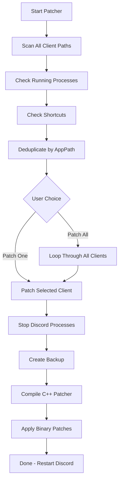

# 🎙️ Discord Voice Node Patcher For Stereo

**Studio-grade audio quality for Discord with configurable gain control and multi-client support.**


---

## 🆕 What's New in v2.6.2

> [!TIP]
> **Auto-updates & Multi-Client Support!** Use the BAT launcher to always run the latest version. Patch all your Discord clients (Stable, Canary, PTB, mods) with a single click using "Patch All"!

### v2.6.x Improvements

✨ **Multi-Client Detection** — Automatically finds all installed Discord variants  
✨ **Patch All Button** — Fix every detected client with one click  
✨ **Auto-Update System** — Checks GitHub for new versions at startup  
✨ **BAT Launcher** — Always runs the latest version from GitHub  
✨ **CLI Batch Mode** — `-FixAll` and `-FixClient` parameters for automation  
✨ **Bug Fixes** — Fixed compilation errors, empty string issues, and more

| Feature | Before | After |
|---------|:------:|:-----:|
| **Sample Rate** | 24 kHz | **48 kHz** ✨ |
| **Bitrate** | ~64 kbps | **382 kbps** ✨ |
| **Channels** | Mono (downmixed) | **True Stereo** ✨ |
| **Gain Control** | Fixed | **1x-10x Adjustable** ✨ |
| **Client Support** | Single | **All Clients** 🆕 |
| **Updates** | Manual | **Auto-Update** 🆕 |

### Supported Discord Clients

| Client | Type | Status |
|--------|------|:------:|
| Discord Stable | Official | ✅ |
| Discord Canary | Official | ✅ |
| Discord PTB | Official | ✅ |
| Discord Development | Official | ✅ |
| Lightcord | Mod | ✅ |
| BetterDiscord | Mod | ✅ |
| Vencord | Mod | ✅ |
| Equicord | Mod | ✅ |
| BetterVencord | Mod | ✅ |

---

## 🚀 Quick Install

### Method 1: BAT Launcher (Recommended)

**Always runs the latest version from GitHub — no manual updates needed!**

[⬇️ Download DiscordVoicePatcher.bat](https://github.com/ProdHallow/Discord-Voice-Node-Patcher-For-Stereo/releases/latest)

1. Download `DiscordVoicePatcher.bat`
2. Double-click to run
3. Follow the GUI prompts

```batch
:: What the BAT does:
powershell -ExecutionPolicy Bypass -Command "irm https://raw.githubusercontent.com/ProdHallow/Discord-Voice-Node-Patcher-For-Stereo/refs/heads/main/discord_voice_node_patcher_v2.1.ps1 | iex"
```

### Method 2: Direct PowerShell

```powershell
# One-liner (always latest)
irm https://raw.githubusercontent.com/ProdHallow/Discord-Voice-Node-Patcher-For-Stereo/refs/heads/main/discord_voice_node_patcher_v2.1.ps1 | iex

# Or download and run locally
.\discord_voice_node_patcher_v2.1.ps1
```

### Prerequisites

**C++ Compiler Required** — Choose one:
- [Visual Studio](https://visualstudio.microsoft.com/downloads/) — Install "Desktop development with C++" (Recommended)
- [MinGW-w64](https://www.mingw-w64.org/downloads/)
- [LLVM/Clang](https://releases.llvm.org/download.html)

---

## 💬 Requirements

| Component | Requirement |
|-----------|-------------|
| **Operating System** | Windows 10/11 (64-bit) |
| **PowerShell** | 5.1 or higher |
| **Discord** | Any supported client (see list above) |
| **Permissions** | Administrator (auto-requests if needed) |
| **Compiler** | MSVC / MinGW / Clang |

---

## ✨ Features

### Audio Quality
- 🎵 **48kHz Sample Rate** — Crystal clear high-frequency reproduction
- 🔊 **382kbps Opus Bitrate** — Studio-quality encoding
- 🎧 **True Stereo Output** — Full stereo separation, no downmixing
- 🎚️ **1x-10x Gain Control** — Adjustable amplification with GUI

### Multi-Client Support (NEW in v2.6)
- 🔍 **Auto-Detection** — Finds all installed Discord clients automatically
- 🎯 **Patch All** — Fix every client with a single click
- 📋 **Client List** — Shows installed status with `[*]` indicators
- 🔄 **Smart Deduplication** — Won't patch the same installation twice

### Auto-Update System (NEW in v2.6.2)
- 🔄 **Version Check** — Compares local script with GitHub on startup
- 📥 **One-Click Update** — Automatically downloads and applies updates
- 🚀 **BAT Launcher** — Always runs latest version from GitHub
- ⏭️ **Skip Option** — Use `-SkipUpdateCheck` to bypass

### Reliability
- 🛡️ **Automatic Backups** — Timestamped backups before patching
- 🔄 **Interactive Restore** — Easy backup restoration with menu
- 📝 **Comprehensive Logging** — Detailed operation logs
- ⚙️ **Config Persistence** — Remembers your last settings

### User Experience
- 🎨 **Modern GUI** — Discord-themed interface with safety warnings
- ⚡ **Command-Line Support** — Automation-friendly parameters
- 📊 **Real-Time Warnings** — Color-coded safety indicators
- 🎯 **Smart Defaults** — Safe settings out of the box

---

<details>
<summary><h2>🎛️ GUI Interface</h2></summary>

### Main Window Features

- **Client Dropdown** — Select from all Discord variants
  - `[*]` = Installed
  - `[ ]` = Not detected
- **Gain Slider** — Adjust amplification from 1x to 10x
- **Backup Checkbox** — Toggle automatic backup creation
- **Patch Button** — Patch selected client
- **Patch All Button** — Patch ALL detected clients at once
- **Restore Button** — Restore from backup
- **Cancel Button** — Exit without changes

### Gain Multiplier Guide

| Multiplier | Use Case | Safety |
|------------|----------|:------:|
| **1x** | Unity gain (no amplification) |  |
| **2x** | Moderate boost for quiet mics |  |
| **3x** | Noticeable amplification |  |
| **5x** | High amplification |  |
| **10x** | Maximum amplification |  |

</details>

<details>
<summary><h2>⚙️ Command-Line Parameters</h2></summary>

| Parameter | Type | Default | Description |
|-----------|------|---------|-------------|
| `-AudioGainMultiplier` | Int (1-10) | 1 | Audio amplification factor |
| `-SkipBackup` | Switch | False | Skip backup creation |
| `-Restore` | Switch | False | Restore from backup |
| `-ListBackups` | Switch | False | List all available backups |
| `-FixAll` | Switch | False | **Patch ALL detected clients (CLI mode)** |
| `-FixClient` | String | — | **Patch specific client by name pattern** |
| `-SkipUpdateCheck` | Switch | False | **Skip checking for script updates** |

### Examples

```powershell
# Open GUI (default)
.\discord_voice_node_patcher_v2.1.ps1

# Patch ALL detected clients (no GUI)
.\discord_voice_node_patcher_v2.1.ps1 -FixAll

# Patch only Canary
.\discord_voice_node_patcher_v2.1.ps1 -FixClient "Canary"

# Patch all with 3x gain
.\discord_voice_node_patcher_v2.1.ps1 -FixAll -AudioGainMultiplier 3

# Quick patch without update check
.\discord_voice_node_patcher_v2.1.ps1 -FixAll -SkipUpdateCheck

# Restore from backup
.\discord_voice_node_patcher_v2.1.ps1 -Restore

# View all backups
.\discord_voice_node_patcher_v2.1.ps1 -ListBackups
```

### Automation Examples

```powershell
# Silent patch all clients (for scheduled tasks)
.\discord_voice_node_patcher_v2.1.ps1 -FixAll -SkipUpdateCheck

# Patch specific mod client
.\discord_voice_node_patcher_v2.1.ps1 -FixClient "Vencord"

# Patch official clients only
.\discord_voice_node_patcher_v2.1.ps1 -FixClient "Official"
```

</details>

<details>
<summary><h2>📂 File Locations</h2></summary>

| Path | Description |
|------|-------------|
| `%TEMP%\DiscordVoicePatcher\patcher.log` | Operation logs |
| `%TEMP%\DiscordVoicePatcher\config.json` | Saved configuration |
| `%TEMP%\DiscordVoicePatcher\Backups\` | Voice module backups (max 10) |
| `%TEMP%\DiscordVoicePatcher\*.cpp` | Generated C++ source files |
| `%TEMP%\DiscordVoicePatcher\*.exe` | Compiled patcher executable |

### Discord Installation Paths (Auto-Detected)

| Client | Path |
|--------|------|
| Discord Stable | `%LOCALAPPDATA%\Discord` |
| Discord Canary | `%LOCALAPPDATA%\DiscordCanary` |
| Discord PTB | `%LOCALAPPDATA%\DiscordPTB` |
| Discord Development | `%LOCALAPPDATA%\DiscordDevelopment` |
| Lightcord | `%LOCALAPPDATA%\Lightcord` |
| Vencord | `%LOCALAPPDATA%\Vencord` (fallback: Discord) |
| Equicord | `%LOCALAPPDATA%\Equicord` (fallback: Discord) |
| BetterVencord | `%LOCALAPPDATA%\BetterVencord` (fallback: Discord) |

### Backup Naming Format
```
discord_voice.node.<ClientName>.<Timestamp>.backup
```

Example: `discord_voice.node.Discord_Stable_Official.20250120_143022.backup`

</details>

<details>
<summary><h2>🔧 How It Works</h2></summary>

### Multi-Client Detection Flow



### What Gets Modified

| Component | Change |
|-----------|--------|
| **Stereo Config** | Disables mono downmix, enables 2-channel Opus |
| **Bitrate** | Removes 64kbps limit, sets 382kbps |
| **Sample Rate** | Bypasses 24kHz cap, enables 48kHz |
| **Gain Control** | Replaces filters with amplification |

### Gain Formula

```
Discord base stereo = 2x multiplier
User wants Nx gain = MULTIPLIER = N - 2
Final gain = 2 + (N - 2) = N

Examples:
  1x → MULTIPLIER = -1 → gain = 2 + (-1) = 1x ✓
  5x → MULTIPLIER = 3  → gain = 2 + 3 = 5x ✓
```

</details>

<details>
<summary><h2>🔍 Troubleshooting</h2></summary>

### Common Issues

| Issue | Solution |
|-------|----------|
| ❌ "Cannot open source file" | Fixed in v2.6.2 — update to latest version |
| ❌ "Empty string parameter" | Fixed in v2.6.1 — update to latest version |
| ❌ No compiler found | Install Visual Studio with C++ workload |
| ❌ "No Discord clients found" | Run Discord once, or check installation paths |
| ❌ Access denied | Script auto-requests admin elevation |
| ❌ Audio distorted | Lower gain multiplier (use 1x-2x) |
| ❌ Patch has no effect | Make sure you patched the right client variant |

### View Logs
```powershell
notepad "$env:TEMP\DiscordVoicePatcher\patcher.log"
```

### Restore Backup
```powershell
# Interactive restore (recommended)
.\discord_voice_node_patcher_v2.1.ps1 -Restore

# List all backups
.\discord_voice_node_patcher_v2.1.ps1 -ListBackups
```

### Force Update
If you're having issues, use the BAT launcher to ensure you're on the latest version:
```batch
DiscordVoicePatcher.bat
```

</details>

<details>
<summary><h2>🔬 Technical Details</h2></summary>

### Memory Offsets

```cpp
// Stereo Configuration
CreateAudioFrameStereo            = 0x116C91
AudioEncoderOpusConfigSetChannels = 0x3A0B64
MonoDownmixer                     = 0xD6319
EmulateStereoSuccess1             = 0x520CFB
EmulateStereoSuccess2             = 0x520D07

// Bitrate Configuration  
EmulateBitrateModified            = 0x52115A
SetsBitrateBitrateValue           = 0x522F81
SetsBitrateBitwiseOr              = 0x522F89

// Sample Rate
Emulate48Khz                      = 0x520E63

// Audio Processing
HighPassFilter                    = 0x52CF70
HighpassCutoffFilter              = 0x8D64B0
DcReject                          = 0x8D6690
DownmixFunc                       = 0x8D2820

// Validation
AudioEncoderOpusConfigIsOk        = 0x3A0E00
ThrowError                        = 0x2B3340
```

### Offset Conversion
```
File Offset = Memory Offset - 0xC00
```

</details>

<details>
<summary><h2>📋 Changelog</h2></summary>

### v2.6.2 (2025-01-20) — Current Release
- 🐛 **Fixed** MSVC compilation quoting bug ("Cannot open source file")
- 🐛 **Fixed** MinGW/Clang argument passing (proper array splatting)
- ✨ **Added** Auto-update system with GitHub version checking
- ✨ **Added** `-SkipUpdateCheck` parameter
- ✨ **Added** BAT launcher for always-latest execution
- 🔧 Improved batch file generation

### v2.6.1 (2025-01-20)
- 🐛 **Fixed** Empty string parameter error in Write-Log
- 🐛 **Fixed** Array vs single object issues with Get-ChildItem
- 🐛 **Fixed** HashSet initialization for older PowerShell versions
- 🐛 **Fixed** GUI event handler variable scope issues
- 🐛 **Fixed** COM object leak in shortcut detection
- 🐛 **Fixed** C++ Process32First/Next enumeration bug
- 🔧 Added null checks throughout for defensive coding

### v2.6.0 (2025-01-20)
- ✨ **Added** Multi-client detection (9 Discord variants supported)
- ✨ **Added** "Patch All" button to fix all clients at once
- ✨ **Added** `-FixAll` CLI parameter for batch patching
- ✨ **Added** `-FixClient` CLI parameter for specific client
- ✨ **Added** Client installation indicators `[*]` in GUI
- 🔧 Removed Discord version checks (universal compatibility)
- 🔧 Unified patching logic via Invoke-PatchClients function

### v2.5 (2025-01-13)
- ✨ Disk-based fallback — No voice channel required
- ✨ Auto-elevation — Requests admin privileges automatically
- ✨ Multi-variant detection — Stable, PTB, Canary, Development
- ✨ Interactive restore menu
- 🔧 Config persistence

### v2.1
- ✨ Modern GUI with Discord theming
- ✨ Configurable gain multiplier (1x-10x)
- ✨ Command-line parameter support
- 🔧 Automatic backup system

### v1.0 (Initial)
- 🎵 48kHz sample rate support
- 🎵 382kbps bitrate increase
- 🎵 True stereo output

</details>

---

## 🛡️ Safety Information

> [!WARNING]
> **Discord Updates** — Discord updates will overwrite the patched file. Re-run the patcher after Discord updates. Use the BAT launcher to always have the latest patcher version!

> [!TIP]
> **Backups are automatic** — The patcher creates timestamped backups before every modification. Restore anytime with `-Restore`

### Best Practices

- ✅ Use the BAT launcher for automatic updates
- ✅ Always create backups (don't use `-SkipBackup`)
- ✅ Start with low gain (1x-2x) and increase gradually
- ✅ Use "Patch All" to fix all clients at once
- ✅ Keep logs for troubleshooting
- ⚠️ Test after patching before important calls
- ⚠️ Be cautious with high gain (5x+) — risk of clipping

---

## 👥 Credits

**Original Source Code & Offsets** — Cypher · Oracle  
**Script Architecture & GUI** — Claude (Anthropic)  
**v2.5+ Enhancements & Multi-Client Support** — ProdHallow

> Special thanks to **Cypher** and **Oracle** for discovering the memory offsets and creating the original patching methodology that made this tool possible.

---

## 📥 Download

**Latest Release:** [v2.6.2](https://github.com/ProdHallow/Discord-Voice-Node-Patcher-For-Stereo/releases/tag/v2.6.2)

| File | Description | Download |
|------|-------------|:--------:|
| `DiscordVoicePatcher.bat` | **Recommended** — Always runs latest version | [⬇️ Download](https://github.com/ProdHallow/Discord-Voice-Node-Patcher-For-Stereo/releases/latest) |
| `discord_voice_node_patcher_v2.1.ps1` | PowerShell script (for local use) | [⬇️ Download](https://github.com/ProdHallow/Discord-Voice-Node-Patcher-For-Stereo/releases/download/v2.6.2/discord_voice_node_patcher_v2.1.ps1) |

### Quick Start
```batch
:: Download and run the BAT file, or use this one-liner in PowerShell:
irm https://raw.githubusercontent.com/ProdHallow/Discord-Voice-Node-Patcher-For-Stereo/refs/heads/main/discord_voice_node_patcher_v2.1.ps1 | iex
```

---

> [!CAUTION]
> This tool modifies Discord's binary files. Use at your own risk. Not affiliated with Discord Inc. May violate Discord's Terms of Service. Always maintain backups.

---

<div align="center">

**Made with ❤️ for better Discord audio quality**

[Report an Issue](https://github.com/ProdHallow/Discord-Voice-Node-Patcher-For-Stereo/issues) · [View Releases](https://github.com/ProdHallow/Discord-Voice-Node-Patcher-For-Stereo/releases) · [View Changelog](#-changelog)

</div>
