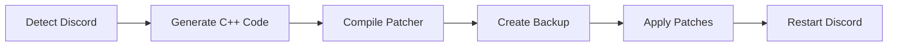

# 🎙️ Discord Voice Node Patcher For Stereo

**Studio-grade audio quality for Discord with configurable gain control.**


---

## 🆕 What's New in v2.1

> [!TIP]
> **Modern GUI with configurable gain!** Choose from 1x to 10x audio amplification with real-time safety warnings. Perfect stereo, 48kHz sampling, and 382kbps bitrate — all in one click.

| Feature | Before | After |
|---------|:------:|:-----:|
| **Sample Rate** | 24 kHz | **48 kHz** ✨ |
| **Bitrate** | ~64 kbps | **382 kbps** ✨ |
| **Channels** | Mono (downmixed) | **True Stereo** ✨ |
| **Gain Control** | Fixed | **1x-10x Adjustable** ✨ |

---

## 🚀 Quick Install

**Step 1: Install a C++ Compiler**

Choose one (Visual Studio recommended):
- [Visual Studio](https://visualstudio.microsoft.com/downloads/) — Install "Desktop development with C++"
- [MinGW-w64](https://www.mingw-w64.org/downloads/)
- [LLVM/Clang](https://releases.llvm.org/download.html)

**Step 2: Run the Patcher**

```powershell
# Right-click PowerShell → "Run as Administrator"
.\DiscordVoicePatcher.ps1
```

<details>
<summary><strong>Command Line Options (Advanced)</strong></summary>

```powershell
.\DiscordVoicePatcher.ps1 -NoGUI -AudioGainMultiplier 3        # 3x gain, no GUI
.\DiscordVoicePatcher.ps1 -NoGUI -AudioGainMultiplier 1        # Unity gain (no amp)
.\DiscordVoicePatcher.ps1 -NoGUI -AudioGainMultiplier 5 -SkipBackup  # 5x, skip backup
```
</details>

---

## 💬 Requirements

| Component | Requirement |
|-----------|-------------|
| **Operating System** | Windows 10/11 (64-bit) |
| **PowerShell** | 5.1 or higher |
| **Discord Version** | v9219 (Stable) |
| **Permissions** | Administrator |
| **Compiler** | MSVC / MinGW / Clang |

---

## ✨ Features

- 🎵 **48kHz Sample Rate** — Crystal clear high-frequency reproduction
- 🔊 **382kbps Opus Bitrate** — Studio-quality encoding
- 🎧 **True Stereo Output** — Full stereo separation, no downmixing
- 🎚️ **1x-10x Gain Control** — Adjustable amplification with GUI
- 🛡️ **Automatic Backups** — Timestamped backups before patching
- 🎨 **Modern GUI** — Discord-themed interface with safety warnings
- ⚡ **Command-Line Support** — Automation-friendly parameters
- 📊 **Real-Time Warnings** — Color-coded safety indicators
- 📝 **Comprehensive Logging** — Detailed operation logs
- 🔄 **Easy Rollback** — Restore from backups anytime

---

<details>
<summary><h2>🎛️ GUI Interface</h2></summary>

### Gain Multiplier Guide

| Multiplier | Use Case | Safety |
|------------|----------|:------:|
| **1x** | Unity gain (no amplification) |  |
| **2x** | Moderate boost for quiet mics |  |
| **3x** | Noticeable amplification |  |
| **5x** | High amplification |  |
| **10x** | Maximum amplification |  |

### GUI Elements

- **Slider Control** — Smooth 1x to 10x gain adjustment
- **Live Preview** — See current multiplier in real-time
- **Color Coding** — Green (safe), Yellow (moderate), Red (high risk)
- **Backup Option** — Toggle automatic backup creation
- **Patch Button** — Apply settings and patch Discord
- **Cancel Button** — Exit without changes

</details>

<details>
<summary><h2>⚙️ Command-Line Parameters</h2></summary>

| Parameter | Type | Default | Description |
|-----------|------|---------|-------------|
| `-AudioGainMultiplier` | Int (1-10) | 1 | Audio amplification factor |
| `-SkipBackup` | Switch | False | Skip backup creation |
| `-NoGUI` | Switch | False | Run without GUI |

### Examples

```powershell
# Safe default (2x gain with backup)
.\DiscordVoicePatcher.ps1 -NoGUI -AudioGainMultiplier 2

# Maximum quality (unity gain, no amplification)
.\DiscordVoicePatcher.ps1 -NoGUI -AudioGainMultiplier 1

# High gain for quiet sources
.\DiscordVoicePatcher.ps1 -NoGUI -AudioGainMultiplier 5

# Quick patch (skip backup)
.\DiscordVoicePatcher.ps1 -NoGUI -AudioGainMultiplier 3 -SkipBackup
```

</details>

<details>
<summary><h2>📂 File Locations</h2></summary>

| Path | Description |
|------|-------------|
| `%TEMP%\DiscordVoicePatcher\patcher.log` | Operation logs |
| `%TEMP%\DiscordVoicePatcher\Backups\` | Voice module backups |
| `%TEMP%\DiscordVoicePatcher\*.cpp` | Generated C++ source files |
| `%TEMP%\DiscordVoicePatcher\*.exe` | Compiled patcher executable |

### Backup Naming Format
```
discord_voice.node.YYYYMMDD_HHMMSS.backup
```

Example: `discord_voice.node.20250108_143022.backup`

</details>

<details>
<summary><h2>🔧 How It Works</h2></summary>

### Patching Process



### What Gets Modified

| Component | Change |
|-----------|--------|
| **Stereo Config** | Disables mono downmix, enables 2-channel Opus |
| **Bitrate** | Removes 64kbps limit, sets 382kbps |
| **Sample Rate** | Bypasses 24kHz cap, enables 48kHz |
| **Gain Control** | Replaces filters with amplification |

### Gain Formula

```
Discord base stereo = 2x multiplier
User wants Nx gain = MULTIPLIER = N - 2
Final gain = 2 + (N - 2) = N

Examples:
  1x → MULTIPLIER = -1 → gain = 2 + (-1) = 1x ✓
  5x → MULTIPLIER = 3  → gain = 2 + 3 = 5x ✓
```

</details>

<details>
<summary><h2>🔍 Troubleshooting</h2></summary>

### Common Issues

| Issue | Solution |
|-------|----------|
| ❌ Discord not running | Start Discord before running patcher |
| ❌ No compiler found | Install Visual Studio with C++ workload |
| ❌ Access denied | Run PowerShell as Administrator |
| ❌ Audio distorted | Lower gain multiplier (use 1x-2x) |
| ❌ Version mismatch | Verify Discord is v9219 |

### View Logs
```powershell
notepad "$env:TEMP\DiscordVoicePatcher\patcher.log"
```

### Restore Backup
```powershell
# List backups
Get-ChildItem "$env:TEMP\DiscordVoicePatcher\Backups"

# Restore latest backup
Copy-Item "$env:TEMP\DiscordVoicePatcher\Backups\discord_voice.node.*.backup" `
          "C:\Path\To\Discord\discord_voice.node"
```

</details>

<details>
<summary><h2>🔬 Technical Details</h2></summary>

### Memory Offsets (Discord v9219)

```cpp
// Stereo Configuration
CreateAudioFrameStereo            = 0x116C91
AudioEncoderOpusConfigSetChannels = 0x3A0B64
MonoDownmixer                     = 0xD6319

// Bitrate Configuration  
EmulateBitrateModified            = 0x52115A
SetsBitrateBitrateValue           = 0x522F81

// Sample Rate
Emulate48Khz                      = 0x520E63

// Audio Processing
HighPassFilter                    = 0x52CF70
DcReject                          = 0x8D6690
```

### Patching Techniques

| Technique | Purpose |
|-----------|---------|
| **NOP Instructions** | Disable unwanted code (0x90) |
| **Jump Redirects** | Change conditional to unconditional jumps |
| **Function Injection** | Insert custom audio processing |
| **Direct Modification** | Overwrite specific instruction bytes |

</details>

<details>
<summary><h2>📋 Changelog</h2></summary>

### v2.1 (Current)
- ✨ Modern GUI with Discord theming
- ✨ Configurable gain multiplier (1x-10x)
- ✨ Command-line parameter support
- 🐛 Fixed multiplier calculation for stereo
- 🐛 Fixed GUI layout overlapping
- 🔧 Improved error handling and logging
- 🔧 Automatic backup system
- 📚 Comprehensive documentation

### v1.0 (Initial)
- 🎵 48kHz sample rate support
- 🎵 382kbps bitrate increase
- 🎵 True stereo output
- 🎵 Fixed 9dB gain

</details>

---

## 🛡️ Safety Information

> [!WARNING]
> **Discord Updates** — Discord updates will overwrite the patched file. You'll need to re-patch after major Discord updates.

> [!TIP]
> **Backups are automatic** — The patcher creates timestamped backups before every modification. You can always restore the original file.

### Best Practices

- ✅ Always create backups (don't use `-SkipBackup`)
- ✅ Start with low gain (1x-2x) and increase gradually
- ✅ Keep logs for troubleshooting
- ✅ Verify Discord version before patching
- ⚠️ Test after patching before important calls
- ⚠️ Be cautious with high gain (5x+) — risk of clipping

---

## 📦 Source Code

Available on request — Contact for repository access

---

## 👥 Credits

**Original Source Code & Offsets** — Cypher · Oracle  
**Script Architecture & GUI** — Claude (Anthropic)

> Special thanks to **Cypher** and **Oracle** for discovering the memory offsets and creating the original patching methodology that made this tool possible.

---

> [!CAUTION]
> This tool modifies Discord's binary files. Use at your own risk. Not affiliated with Discord Inc. May violate Discord's Terms of Service. Always maintain backups.

---

<div align="center">

**Made with ❤️ for better Discord audio quality**

[Report an Issue](#) · [Request a Feature](#) · [View Changelog](#-changelog)

</div>
